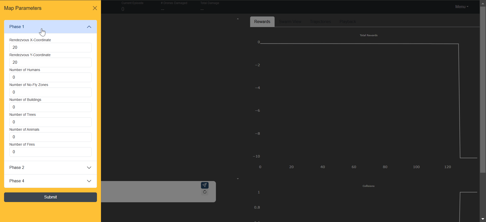
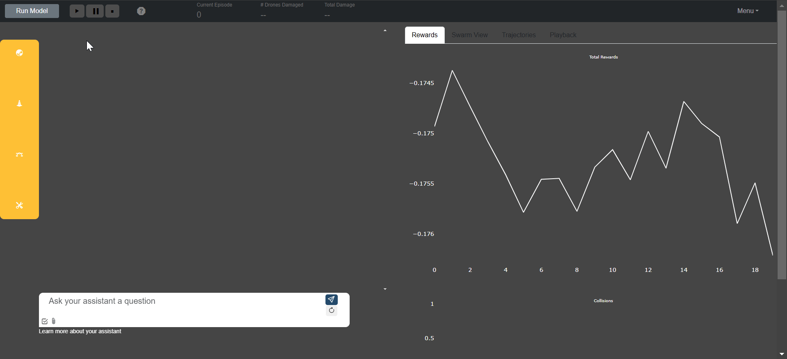
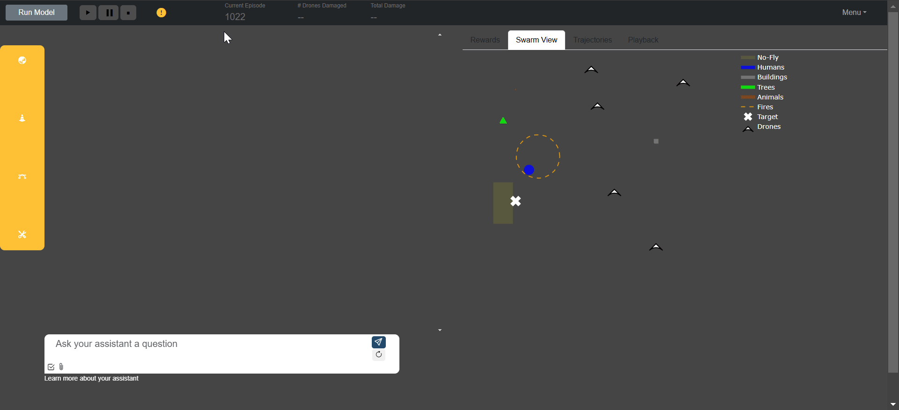
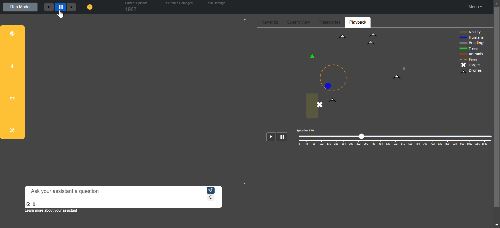
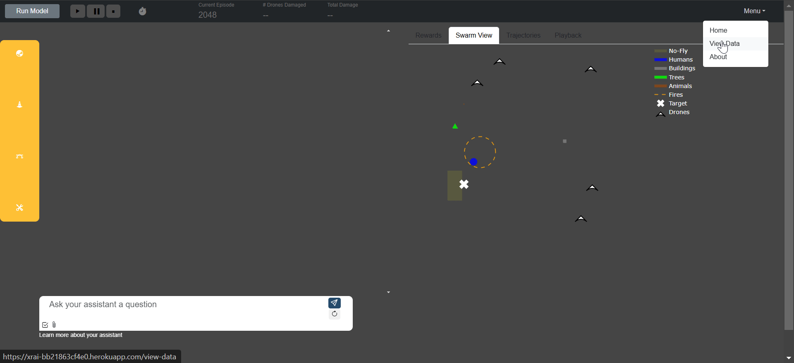

# Main Points
- This interface was created as part of a project that sought to apply XAI and RAI principles to an autonomous vehicle DRL. It allows you to analyze the training of a drone swarm DRL with the option to adjust swarm parameters and responsibility constraints (i.e. don't hit obstacles)
- This interface was built with Dash, and integrates an OpenAI Assistant by including a chat box. 
- You **can't** run this without the [API]((https://github.com/mklocinski/CapstoneTeamAPI))
- [Arrive here from a GMU SEOR Capstone Course?](#capstone-students)

# Interface Overview
**Select environment, RAI, and DRL parameters:**

**Run model and view progress in real-time:**

**Pause training for closer analysis:**

**Replay mission:**

**View detailed data:**

# Contents
- [Project Description](#project-description)  
    - [Background](#background)
    - [App Description](#app-description)
- [Authentication](#authentication)
- [Getting Started](#getting-started)
  - [Prerequisites](#prerequisites)
  - [How to Download](#how-to-download)
  - [How to Run](#how-to-run)
- [Endpoints](#Endpoints)
  - [Request Bodies](#request-bodies)
- [Database](#database)
- [Architecture](#architecture)
- [Contributing](#contributing)

## Project Description

### Background

### App Description

### Getting Started

#### Prerequisites
